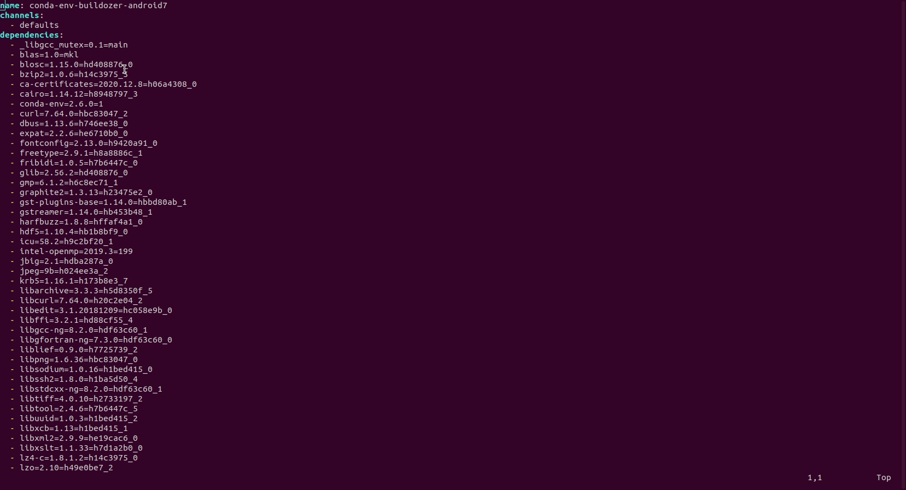
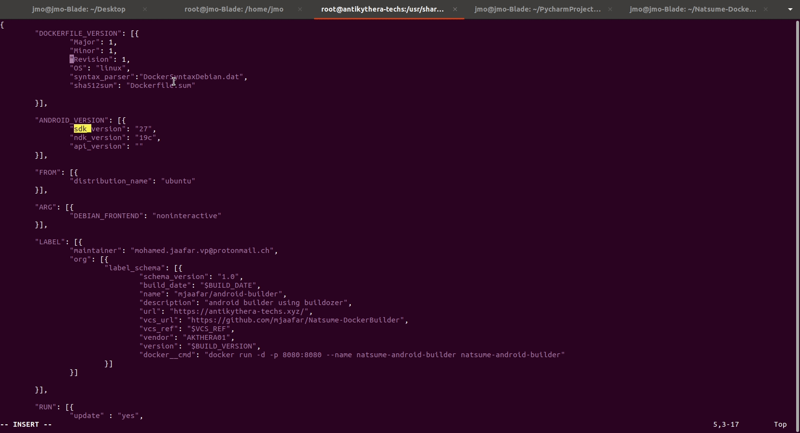

# Natsume-Docker-builder
Natsume is a Cloud build based for docker generation from several environment : conda, anaconda and pip based :

The Json file holds The docker definition and pre and post docker image build.

The Natusme binary checks the Json file definition on the remote server.
The Dockerfile.json is downloaded and parsed. yml definition environement file is checked and adds the python packages to the Dockerfile.
The image is built and added to the local repository and then executed automatically.

