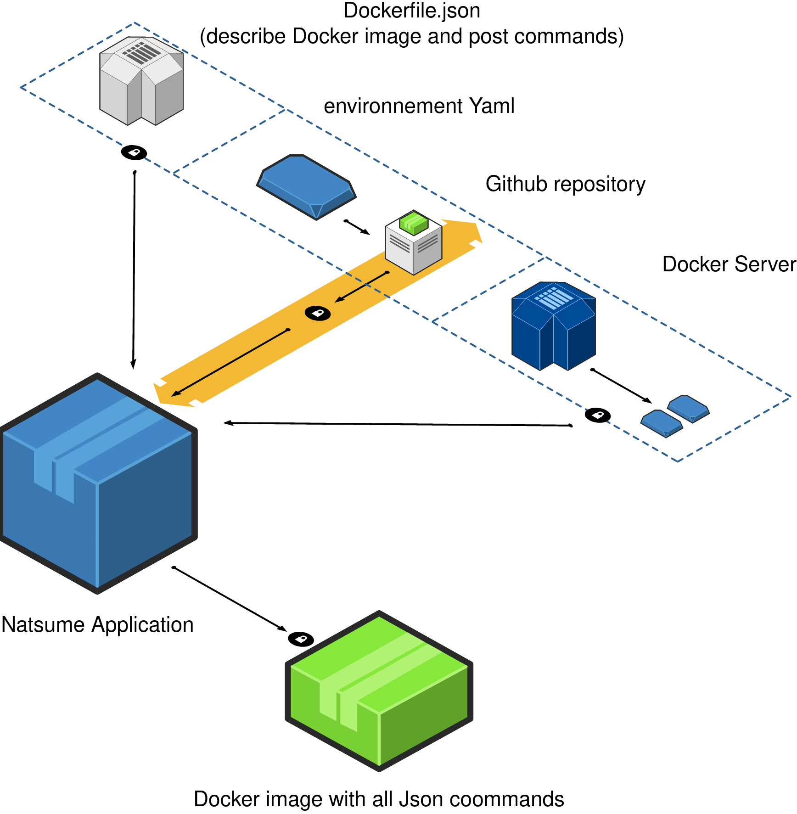

# Natsume-Docker-builder :
Support :

Wallet : 3PB2eDTnNEGY3sn528gs7AD2M2D695jJji

Eth : 0xbd3fc8a435e4bb3497c7330ed7672fc866f91dcb

## Natsume Presentation  :
__Natsume__ is a Cloud build based for docker generation from several environment : `conda` , `anaconda` and `pip` based :

 
 
 

 
 
 
The `Json file` holds The docker definition and pre and post docker image build.
 
 
 

 
 
 
__Natusme__ binary checks the Json file definition on the remote server.
The `Dockerfile.json` is downloaded and parsed. `yml` definition environement file is checked and adds the python packages to the `Dockerfile`.
The image is built and added to the local repository and then executed automatically.
 
 
 

## Natsume delivery :
__Natsume__ uses secured TLS connection with the server to retrieve the json file and learn about the building process.
 
The secured server chain is hold in app/server-nginx-configuration/client-conf/ :
 
1) Trusted certificate in case of self signed certificate : `nginx-selfsigned.crt`
2) Client certificate : `client.crt`
3) Client private key : `client.key`
